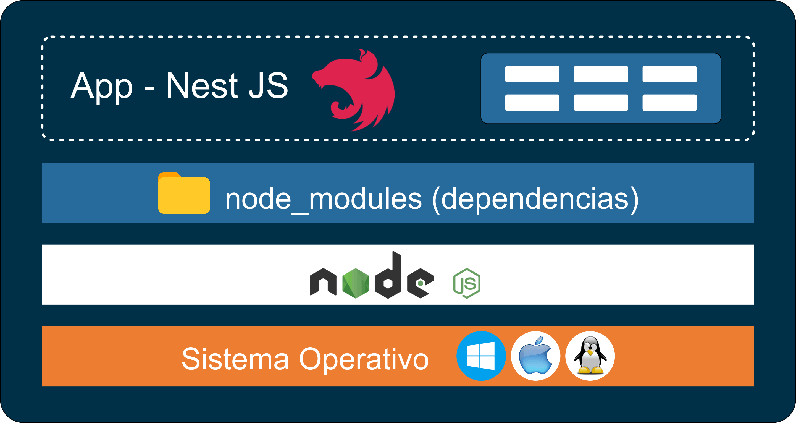
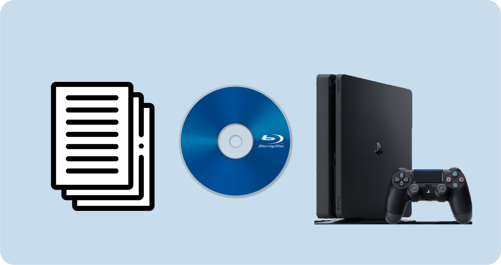
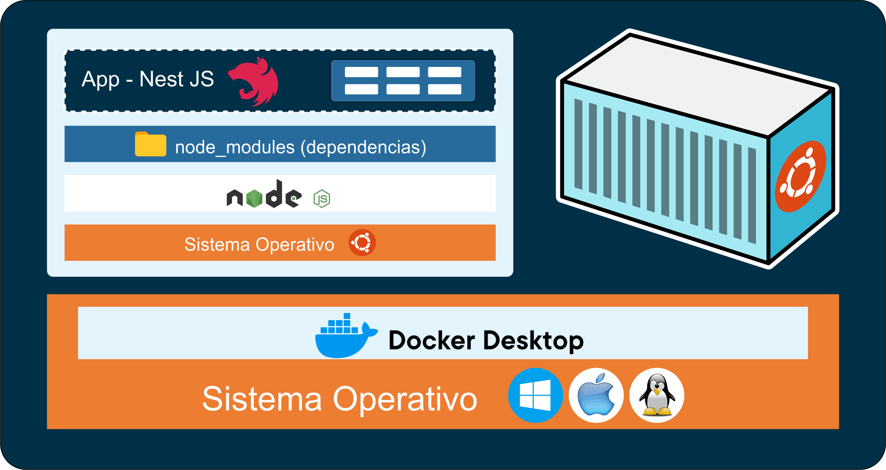

# Taller de Docker

## ¿QUÉ PROBLEMA VIENE A RESOLVER DOCKER?

Docker resuelve varios problemas clave en el desarrollo y despliegue de aplicaciones:

- Consistencia entre entornos: Docker asegura que el software se ejecuta de manera consistente en cualquier entorno, ya sea en la máquina local de un desarrollador, en servidores de pruebas, o en producción. Esto se logra encapsulando todas las dependencias y configuraciones en contenedores.

- Aislamiento de aplicaciones: Docker permite ejecutar múltiples aplicaciones en un mismo servidor sin que interfieran entre sí. Cada contenedor tiene su propio sistema de archivos, red y espacio de procesos, asegurando que los cambios en un contenedor no afecten a otros.

- Escalabilidad y gestión de recursos: Docker facilita la escalabilidad horizontal al permitir la creación y destrucción rápida de contenedores. Esto es útil en entornos de microservicios donde cada componente de la aplicación puede ser escalado de manera independiente.

- Portabilidad: Los contenedores Docker pueden ser movidos fácilmente entre diferentes sistemas y plataformas, ya que incluyen todo lo necesario para ejecutar una aplicación. Esto elimina problemas de compatibilidad entre sistemas operativos y configuraciones de hardware.

- Desarrollo y despliegue continuo: Docker integra bien con sistemas de integración continua (CI) y despliegue continuo (CD), permitiendo automatizar pruebas y despliegues, reduciendo el tiempo de entrega de nuevas funcionalidades y correcciones.

- Eficiencia de recursos: A diferencia de las máquinas virtuales, los contenedores Docker comparten el núcleo del sistema operativo host, lo que permite un uso más eficiente de los recursos y tiempos de arranque mucho más rápidos.

> En resumen, Docker simplifica el desarrollo, despliegue y operación de aplicaciones, asegurando consistencia, portabilidad y eficiencia en la utilización de recursos.

## ¿CÓMO FUNCIONA UNA APLICACIÓN EN DESARROLLO?



## VEÁMOSLO CON UN EJEMPLO



## ¿CÓMO FUNCIONA DOCKER?



## PRIMER PASO: INSTALAR DOCKER-DESKTOP

### LINKS

- [Docker - Documentación](https://www.docker.com/)
- [Descargar para Windows](https://www.docker.com/products/docker-desktop/)
- [Instructivo de Instalación para Windows](https://docs.docker.com/desktop/install/windows-install/)
- [Documentación para desarrolladores](https://docs.docker.com/?_gl=1*1m0ompz*_ga*MjAyNTczMDU3OS4xNzE0NTE3MzMx*_ga_XJWPQMJYHQ*MTcxNDUxNzMzMS4xLjEuMTcxNDUxODY5OS41Ni4wLjA.)
- [Docker Hub](https://hub.docker.com)
- [Docker Hub - postgres](https://hub.docker.com/_/postgres)

## VERIFICAR INSTALACIÓN

- Ingresamos en la Terminal Integrada:

```bash
docker

docker-compose
```

🎯 Si se ha instalado correctamente recibiremos las opciones que podemos ejecutar en su entorno.

⚠️ Recordar que Docker Desktop debe estar en ejecución para ejecutar sus comandos!!!

## PLUGIN PARA VISUAL STUDIO CODE

- [Link](https://code.visualstudio.com/docs/containers/overview)

El plugin de Docker en Visual Studio Code (VS Code) proporciona una serie de funcionalidades que facilitan el desarrollo y la gestión de contenedores Docker directamente desde el entorno de desarrollo integrado (IDE). Algunas de las principales características y beneficios del plugin incluyen:

1. Explorador de contenedores: Permite ver y gestionar contenedores, imágenes, volúmenes y redes de Docker directamente desde la barra lateral de VS Code. Puedes iniciar, detener y eliminar contenedores, así como inspeccionar sus detalles.
2. Integración con Docker Compose: Facilita la administración de aplicaciones multicontenedor definidas con Docker Compose. Puedes iniciar, detener y administrar servicios definidos en archivos docker-compose.yml.
3. Construcción y ejecución de imágenes: Permite construir imágenes Docker y ejecutar contenedores directamente desde VS Code. Puedes definir tareas en VS Code para automatizar la construcción de imágenes y la ejecución de contenedores.
4. Depuración: Ofrece soporte para depurar aplicaciones que se ejecutan dentro de contenedores Docker. Puedes configurar puntos de interrupción, inspeccionar variables y realizar otras tareas de depuración como lo harías con cualquier otra aplicación.
5. Generación de archivos Docker: Ayuda a crear archivos Dockerfile y docker-compose.yml con plantillas y fragmentos de código predefinidos, facilitando la configuración inicial de Docker para tu proyecto.
6. Integración con terminal: Permite abrir una terminal en el contexto de un contenedor Docker, lo que facilita la ejecución de comandos y la inspección de la aplicación en tiempo real.
7. Compatibilidad con otros plugins: Se integra bien con otros plugins de VS Code, como aquellos para lenguajes de programación específicos o herramientas de DevOps, mejorando la experiencia general de desarrollo.

> En resumen, el plugin de Docker en Visual Studio Code simplifica la interacción con Docker, proporcionando una interfaz gráfica amigable y herramientas de automatización que mejoran la eficiencia y la productividad en el desarrollo y gestión de aplicaciones basadas en contenedores.

## 1. DOCKERFILE

> Creamos en la raíz de nuestro proyecto un ARCHIVO que llamaremos "Dockerfile" y que contendrá:

[Ejemplo de ARCHIVO "Dockerfile"](./assets/Dockerfile)

```Dockerfile
FROM node:18.12
WORKDIR /app
COPY . ./
RUN npm install
EXPOSE 3000
CMD ["node", "app.js"]
```

Detalle:

- FROM node:18.12: Entorno de ejecución a utilizar
- WORKDIR /app: Carpeta raíz del contenedor
- COPY . ./: Ejecutamos TODOS los archivos(.) de raíz(./)
- RUN npm install: Ejecuta "npm install" (en Contenedor)
- EXPOSE 3000: Puerto que expondrá el Contenedor
- CMD ["node", "app.js"]: Comandos a ejecutar

## 2. IMAGEN

### Creación

> Creamos la imagen de nuestra aplicación ingresando en la terminal integrada el comando:

```bash
docker build .
```

- docker build: Comando de docker
- ".": Ubicación donde buscará el archivo "Dockerfile", en este caso, en la misma ubicación donde se encuentra abierta la terminal.
- Una vez creada nos devolverá el "id" de la imagen creada.

### Manejo de Imagenes

- Mediante comandos en consola:

```bash
# Obtener Listado de Imagenes de nuestro sistema:
docker images

docker image ls

# Borrar una Imagen
docker rmi <nombreImagen_o_idImagen>
```

🎯 También podemos gestionarlas desde "Docker Desktop".
⚠️ No podremos borrar una Imagen si existe un Contenedor construído en base a ella.

## 3. CONTENEDOR

### Contenedores y "node_modules"

> Al crearse un Contenedor, éste tendrá TODO EL CÓDIGO NECESARIO PARA CORRER; esto incluye a la "carpeta node_modules", la que se instalará de forma automática por Docker.
> ⚠️ Para evitar conflictos NO incluiremos nuestra carpeta "node_modules":

- Creamos en la raíz del proyecto un ARCHIVO llamado ".dockerignore"
- Indicamos que no se tenga en cuenta la carpeta "node_modules"

[Ejemplo de ARCHIVO ".dockerignore"](./assets/.dockerignore)

```.dockerignore
node_modules
```

### Creación

> Creamos el Contenedor a partir de una Imagennuestra ingresando en la terminal integrada el comando:

```bash
docker run -p 3000:3008 <nombreImagen_o_idImagen>
```

- "docker run": Comando de Docker
- "-p": Indicamos puertos `<puertoHost>:<puertoContenedor>`
  - No necesariamente deben ser los mismos
- Indicamos "id" de la Imagen: sha256:---

### Manejo de Contenedores

```bash
# Obtener listado de Contenedores en Ejecución (process status):
docker ps

# Obtener listado de todos los Contenedores en nuestro sistema:
docker ps -a
docker ps --all

# Detener Contenedor
docker stop <nombreContenedor>

# Borrar Contenedor
docker rm <nombreContenedor_o_idContenedor>

# Correr Contenedor existente
docker start <puertoHost>:<puertoContenedor> <nombreContenedor_o_idContenedor>
```

🎯 También podemos gestionarlas desde "Docker Desktop".

## CONEXIÓN DE CONTENEDORES

### A. Contenedor-Web

> La comunicación entre un Contenedor y una página web, API o Servicio externo se encuentra habilitada por default.

### B. Contenedor-Localhost

> Referenciamos a nuestra Computadora (localhost) como 'host.docker.internal'.

- Por ejemplo, si queremos conectar el contenedor a la base de datos ubicada en nuestra computadora (localhost):

```ts
const config = {
	type: 'postgres',
	database: process.env.DB_NAME,
	host: 'host.docker.internal',
```

🎯 Esto hará que desde el Contenedor se busque nuestro "localhost".

### C. Contenedor-Contenedor

> Para este tipo de Conexiones utilizaremos "Docker-Compose".

## DOCKER COMPOSE

> Docker Compose nos permite realizar toda la configuración en un ARCHIVO, indicando los servicios, imágenes que se utilizarán para la creación de contenedores, puertos y volúmenes.
> 🎯 Un Volumen es una Carpeta que se alojará en nuestra Computadora y le permitirá a un Contenedor guardar Información.
> ⚠️ Tanto una Imagen como un Contenedor son Inmutables, por lo que NO podrán almacenar información que necesite se modificada en su interior, por ejemplo una base de datos.
> 🎯 El formato de archivo que se utiliza es el "yaml" (yet another markup language), el cual se organiza jerárquicamente según la identación.

- Creamos en la raíz del proyecto un ARCHIVO llamado "docker-compose.yaml" con la configuración necesaria:

[Ejemplo de ARCHIVO "docker-compose.yaml"](./assets/docker-compose.yaml)

```yaml
version: "3.8"

services:
	nestapp:
		build: ./
		ports:
			- "3000:3000"
		env_file:
			- .development.env
		depends_on:
			- postgresdb

	postgresdb:
		image: "postgres"
		volumes:
			- pgdata:/var/lib/postgresql/data
		env_file:
			- .development.env

volumes:
	pgdata:
```

Detalle del código:

- version: "3.8": Versión de Docker-Compose
- services: Sección donde declaramos los servicios
- nestapp: Contenedor "App", nuestro Servidor
- build: ./: Ejecuta "Dockerfile" en mismo nivel donde se encuentra el archivo
- ports: Expone puertos "puertoHost:puertoContenedor"
  - "3000:3000"
- env_file: Archivo de variables de entorno
- depends_on: Indica que nuestro Servidor depende del funcionamiento del servicio "postgresdb"
- postgresdb: Servicio "postgresdb"
- volumes: Crea Volúmen "pgdata" para almacenar la información (emulación de la Base de Datos)
- pgdata:/var/lib/postgresql/data: Carpeta por defecto donde se creará el volúmen
- env_file: Archivo de variables de entorno
- volumes: Volúmen del Contenedor => pgdata:

- Una vez creado el archivo de configuración solo queda correr el comando para crear los contenedores:

```bash
docker compose up

# Ó con la consola en segundo plano (detached mode)
docker compose up -d
```

🎯 Para detener los contenedores podremos hacerlo mediante el comando "stop", ó con "Ctrl + c" si lo ejecutamos con la consola abierta.
🎯 Podremos volver a ponerlo en marcha mediante el comando "start".

## ACCEDER A LA CONSOLA SQL DE UN CONTENEDOR

```bash
# Obtener el nombre del CONTENEDOR de la BBDD:
docker ps

# Ingresar a la consola "bash" del contenedor:
docker exec -it <nombreContenedor> bash

# Ingresar a la consola "psql":
psql -U <usuario> -d <base_de_datos>
```
